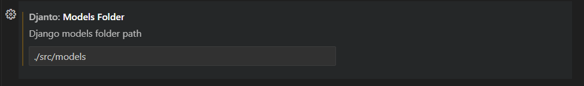
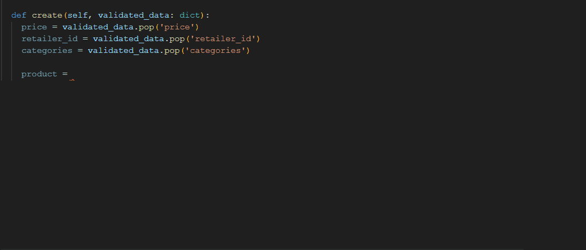

# djanto

Just a small extension for providing `Model.object.create` completion on Django models

## Usage

In order for djanto to be able to find the models of your app you have to set the `djanto.modelsFolder` setting with the path to the folder where your models are at (relative to your work directory). You can achieve this by pressing `Ctrl` + `,` and searching `djanto`. For example:

Once you've done this you'll be ready to go! Just press `Ctrl` + `space` as usual when calling your `Model.object.create()` methods and you'll be prompted the acutal fields for each Model:

Feel free to contact me  at `miguel.martinr11@gmail.com` if you have any question, suggestion or feature request.  :)
